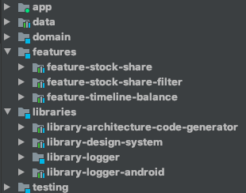
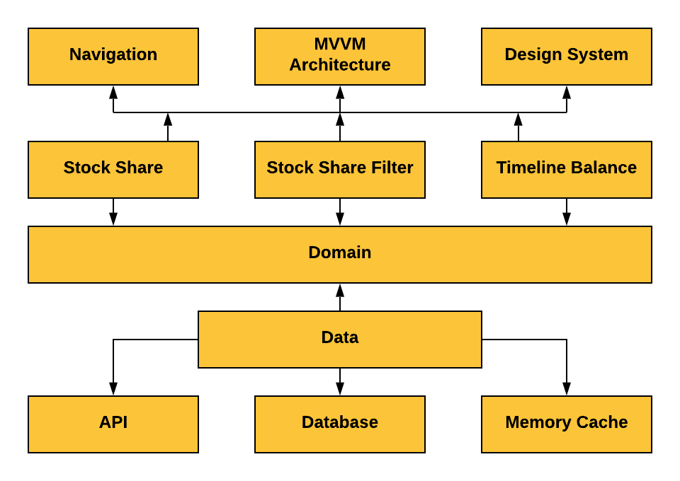

# Stock Trade Tracking
[](https://ktlint.github.io/) 
[](https://kotlinlang.org/) 
[](https://android-arsenal.com/api?level=21)
[](https://opensource.org/licenses/Apache-2.0) 


## About

Stock Trade Tracking is an app where you can register your [Ibovespa](https://pt.wikipedia.org/wiki/Ibovespa) shares and track your profit or loss automatically (Hopefully your profit).

It is a simple showcase for a modern and well-crafted Android application, powered by [Kotlin Coroutines](https://developer.android.com/kotlin/coroutines) and [Clean Architecture](https://www.amazon.com.br/Clean-Architecture-Craftsmans-Software-Structure/dp/0134494164). It is a real modularized MVVM application. 

  

## Project Overview
The code is structured in a multi-module fashion, with semantics guided by [Clean Architecture](https://www.amazon.com.br/Clean-Architecture-Craftsmans-Software-Structure/dp/0134494164).

The domain is a horizontal module that defines all business rules and the core protocols to be implemented by low-level details, while aggregates them in high-level policies by using the [UseCase](http://www.plainionist.net/Implementing-Clean-Architecture-UseCases/) concept from Clean Architecture.

<p align="center">
  
</p>

Below you can see a better representation of how the project is structured in terms of modules dependencies. If you look at the diagram arrows you are going to see that the domain layer does not depend on any other module. It is a pure Kotlin module. 



## Related Libs
Here are some personal libraries used to develop this app:

* [MVVM Archictecture Toolkit](https://github.com/MayconCardoso/Mvvm-Architecture-Toolkit)
* [Architecture Boilerplate Generator](https://github.com/MayconCardoso/ArchitectureBoilerplateGenerator) 
* [Keyboard Visibility Monitor](https://github.com/MayconCardoso/KeyboardVisibilityMonitor)

## Roadmap

You can check out the [Project Board](https://github.com/MayconCardoso/StockTradeTracking/projects/1) to see the next steps.

## License
```
The MIT License (MIT)

Copyright (c) 2020 Maycon Cardoso

Permission is hereby granted, free of charge, to any person obtaining a copy
of this software and associated documentation files (the "Software"), to deal
in the Software without restriction, including without limitation the rights
to use, copy, modify, merge, publish, distribute, sublicense, and/or sell
copies of the Software, and to permit persons to whom the Software is
furnished to do so, subject to the following conditions:

The above copyright notice and this permission notice shall be included in
all copies or substantial portions of the Software.

THE SOFTWARE IS PROVIDED "AS IS", WITHOUT WARRANTY OF ANY KIND, EXPRESS OR
IMPLIED, INCLUDING BUT NOT LIMITED TO THE WARRANTIES OF MERCHANTABILITY,
FITNESS FOR A PARTICULAR PURPOSE AND NONINFRINGEMENT. IN NO EVENT SHALL THE
AUTHORS OR COPYRIGHT HOLDERS BE LIABLE FOR ANY CLAIM, DAMAGES OR OTHER
LIABILITY, WHETHER IN AN ACTION OF CONTRACT, TORT OR OTHERWISE, ARISING FROM,
OUT OF OR IN CONNECTION WITH THE SOFTWARE OR THE USE OR OTHER DEALINGS IN
THE SOFTWARE.
```
